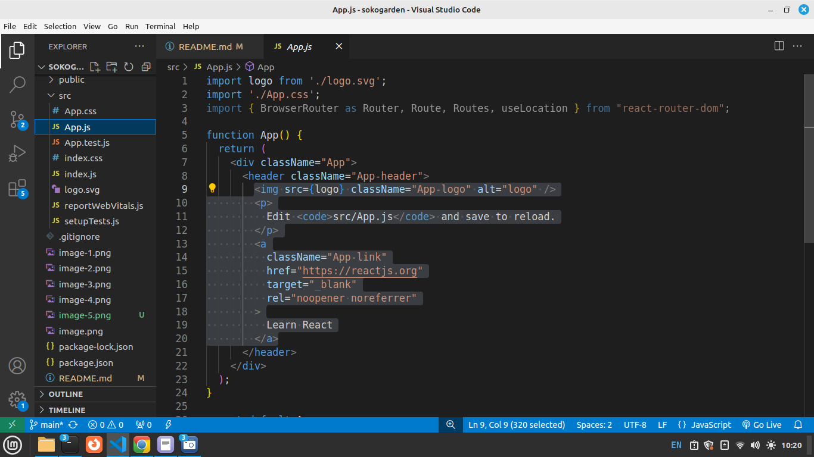
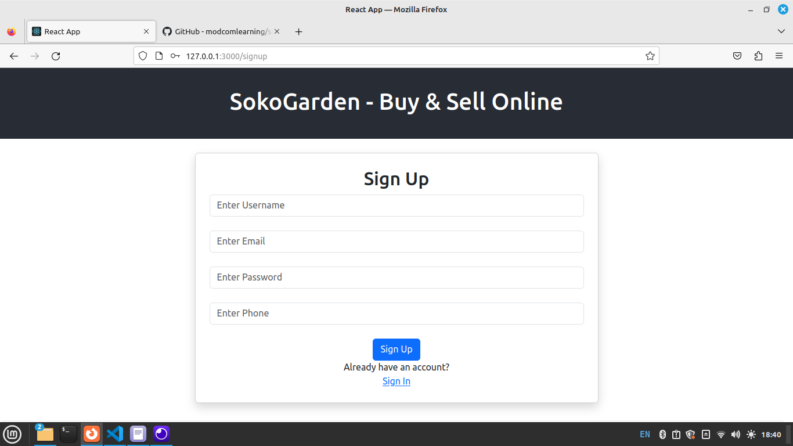
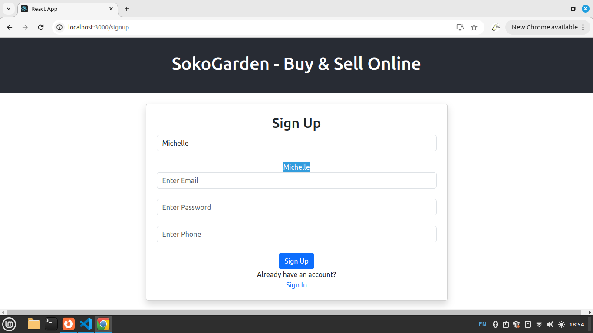

# Getting Started with Create React App

In this github repo, we will create a eCommerce Frontend web application, ReactJS will be used as the frontend framework. The frontend will interact with the backend API to handle:
<br>
✅ User Signup <br>
✅ User Signin<br>
✅ Add Product<br>
✅ Get Products<br>
✅ Make Payment<br>
<br>

Please check the Backend API Implementation here. <br>
https://github.com/modcomlearning/BackendAPI
<br/>

By the end of this repo, you will create an eCommerce web application similar to https://sokogarden.vercel.app/<br>


### Step 1 : Create React App, File Structure, Run App.
This project was bootstrapped with [Create React App](https://github.com/facebook/create-react-app).

In your class Main folder, create a react app using below command
```
   npx create-react-app sokogarden
```

Below is the App Structure Explained<br>


Runs the app in the development mode.\
Open [http://localhost:3000](http://localhost:3000) to view it in your browser.

The page will reload when you make changes.\
You may also see any lint errors in the console.


Your React App runs as below on the browser.


Lets Edit our App.
in src Folder open App.js and remove the higlighted code(remove everything Inside header tags) in below screen.




Replace the code you removed with a heading and as shown below.


Run your App 
Runs the app in the development mode.\
Open [http://localhost:3000](http://localhost:3000) to view it in your browser.
<br>


<br>
<b>Install React Router </b> <br>
```
   npm install react-router-dom
   npm install bootstrap
   npm install axios
```

React Router will be used to create navigation in our App.  <br>
Bootstrap will provide CSS Classes for styling.<br>
Axios will be used in Accessing our Backend APIs created earlier<br>
<br>

in App.js add below import to make bootstrap available in your App.
```jsx
import 'bootstrap/dist/css/bootstrap.min.css';
```

In App.css, Please change the min-height to 20vh, see below, This reduces the height of the Main App.js component display.

```css
.App-header {
  background-color: #282c34;
  min-height: 20vh;
  display: flex;
  flex-direction: column;
  align-items: center;
  justify-content: center;
  font-size: calc(10px + 2vmin);
  color: white;
}
```


Run your App 
Runs the app in the development mode.\
Open [http://localhost:3000](http://localhost:3000) to view it in your browser.


### Step 2: Components Creation
In this Project we will have Components to represent different user interfaces. i.e Signup, Signin, GetProducts, Addproducts, MakePayment, Navbar, Footer etc <br>

Above components MUST be created inside the src Folder,
in src Folder, create a subfolder named components. <br>

Right Click on components folder you created above - Select New File - File name Enter - Signup.js.

Inside Signup.js type below code.

```javascript
  const Signup = () => {
    return (
        <div>
            <h1>Welcome to Signup Component</h1>
        </div>
      );
}
 
export default Signup;
```

Right Click on components folder - Select New File - File name Enter - Signin.js.

Inside Signin.js type below code.

```javascript
const Signin = () => {
    
    return ( 
        <div>
            <h1>Welcome to Signup Component</h1>
        </div>
     );
}
 
export default Signin;

```

Right Click on components folder - Select New File - File name Enter - Addproduct.js.

Inside Addproduct.js type below code.

```javascript
    const Addproduct = () => {
        return ( 
            <div>
                <h1>Welcome to Add Products Component</h1>
            </div>
        );
    }
    
    export default Addproduct;

```
Right Click on components folder - Select New File - File name Enter - Getproducts.js.

Inside Getproducts.js type below code.

```javascript
const Getproducts = () => {
    return ( 
        <div>
            <h1>Welcome to Get Products Components</h1>
        </div>
     );
}

export default Getproducts;
```

We now have 4 different Components.
We need to create routing/navigation for them.This means how do we access them on the browser.

### Step 3: Routing
In this Step we will create Router for our App.
in App.js add below import for routing capabilities
 ```javascript
    import { BrowserRouter as Router, Route, Routes, useLocation } from "react-router-dom";
```
Then inside the App.js, under the JSX code, wrap the 'DIV' with a Router

```javascript
import logo from './logo.svg';
import './App.css';
import { BrowserRouter as Router, Route, Routes, useLocation } from "react-router-dom";


function App() {
  return (

    <Router>   
      <div className="App">
            <header className="App-header">
                <h1>SokoGarden - Buy & Sell Online</h1>
            </header>

            
          
      </div>
    </Router>

  );
}

export default App;
```

Below the header tag add below routes.
```jsx
    <Routes>
        <Route path="/signup" element={<Signup />} />
        <Route path="/signin" element={<Signin />} />
        <Route path="/addproduct" element={<Addproduct />} />
        {/* This is the default component */}
        <Route path="/" element={<Getproducts/>} />
    </Routes>
```


This code defines client-side routing in a React application using React Router. Here's a breakdown:

```jsx 
<Routes>: A wrapper that holds multiple <Route> components and ensures only one matching route is rendered at a time.

<Route path="/signup" element={<Signup/>} />: When the URL is /signup, the Signup component is rendered.

<Route path="/signin" element={<Signin />} />: When the URL is /signin, the Signin component is rendered.

<Route path="/addproduct" element={<Addproduct />} />: When the URL is /addproduct, the Addproduct component is rendered.

<Route path="/" element={<Getproducts/>} />: Acts as the default (home) route, rendering Getproducts when the path is /.<br><br>
```

Your Full App.js Code after adding the Router Code
```jsx
import logo from './logo.svg';
import './App.css';
import { BrowserRouter as Router, Route, Routes, useLocation } from "react-router-dom";
import Signup from './components/Signup';
import Signin from './components/Signin';
import Addproduct from './components/Addproduct';
import Getproducts from './components/Getproducts';

function App() {
  return (
    <Router>
    <div className="App">
          <header className="App-header">
              <h1>SokoGarden - Buy & Sell Online</h1>
          </header>
           <Routes>
            <Route path="/signup" element={<Signup />} />
            <Route path="/signin" element={<Signin />} />
            <Route path="/addproduct" element={<Addproduct />} />
            {/* This is the default component */}
            <Route path="/" element={<Getproducts/>} />
          </Routes>
    </div>
    </Router>
  );
}

export default App;
```

<b>Test Your Routes in the Browser. </b><br>
Signup use:   http://127.0.0.1:3000/signup  <br>
Signin use: http://127.0.0.1:3000/signin<br>
Add Products use: http://127.0.0.1:3000/addproducts<br>
Get products use: http://127.0.0.1:3000/<br>


### Step 4a: Signup
In this Step we will work on Signup component, This component connect to the backend through the signup API created in https://github.com/modcomlearning/BackendAPI(Step4) <br>  NB: Please check Full component code at the end of this Step.
<br>
Open Signup.js Component and import below modules to be used in our code.
Put them before the arrow function 

```jsx
import { useState } from "react";  // for state management
import { Link } from "react-router-dom"; //for routing
import axios from "axios"; //For backend API access
```

Next, we create a signup form in JSX. the form has username, email, password, phone input Fields.
Updated Signup.js Code.

```jsx
import { useState } from "react"; //used for state management
import { Link} from "react-router-dom"; //used for routing
import axios from "axios"; //used for API access

//Arrow function
const Signup = () => {

  return (
    <div className="row justify-content-center mt-4">
      <div className="col-md-6 card shadow p-4">
            
            <h2>Sign Up</h2>
            <form>
                <input
                  type="text"
                  className="form-control"
                  placeholder="Enter Username"
                  required
                /> <br />
               
             
                <input
                  type="email"
                  className="form-control"
                  placeholder="Enter Email"
                  required /> <br />
            
                <input
                  type="password"
                  className="form-control"
                  placeholder="Enter Password"
                  required
                /> <br />
        
             
                <input
                  type="text"
                  className="form-control"
                  placeholder="Enter Phone"
                  required
                /> <br />
          
              <button type="submit" className="btn btn-primary">
                Sign Up
              </button>
            </form>
        
              Already have an account? <Link to="/signin">Sign In</Link>
           
      </div>
    </div>
  );
};

export default Signup;
```

Run your App <br>
Runs the app in the development mode.\
Open [http://localhost:3000](http://localhost:3000) to view it in your browser.

Output - A Signup Form.




Then inside the Arrow function, Create below hooks.

```jsx
  //Below hooks are set to "" since the variables hold no data/strings
  //The hooks will be updated later in this Program
  const [username, setUsername] = useState("");
  const [email, setEmail] = useState("");
  const [password, setPassword] = useState("");
  const [phone, setPhone] = useState("");

```


In JSX Part update your form. <br>
Please Note in below input we update the Hooks defined above using <b>onChange</b> onChange function is called when user enter an input. i.e username<br>   onChange calls the hooks updater function i.e setUsername().
<br>

```jsx
  return (
    <div className="row justify-content-center mt-4">
      <div className="col-md-6 card shadow p-4">
            
            <h2>Sign Up</h2>
            <form>
             
                <input
                  type="text"
                  className="form-control"
                  placeholder="Enter Username"
                  value={username}
                  onChange={(e) => setUsername(e.target.value)}
                  required
                /> <br />
                  {/* Below for testing onChange() concept */}
                 {username}
              
             
                <input
                  type="email"
                  className="form-control"
                  placeholder="Enter Email"
                  value={email}
                  onChange={(e) => setEmail(e.target.value)}
                  required /> <br />
            
                <input
                  type="password"
                  className="form-control"
                  placeholder="Enter Password"
                  value={password}
                  onChange={(e) => setPassword(e.target.value)}
                  required
                /> <br />
        
             
                <input
                  type="text"
                  className="form-control"
                  placeholder="Enter Phone"
                  value={phone}
                  onChange={(e) => setPhone(e.target.value)}
                  required
                /> <br />
          
                <button type="submit" className="btn btn-primary">
                    Sign Up
                </button>
            </form>
        
              Already have an account? <Link to="/signin">Sign In</Link>
      </div>
    </div>
  );

  ```
  <b>NB: In above code, for simplicity, you can do each hook at a time. i.e initialize the username hook, then bind it in the username input and do the onChange().   Then repeat the same for other inputs.</b>

  Run your App <br>
  Runs the app in the development mode.\
  Open [http://localhost:3000](http://localhost:3000) to view it in your browser.
  <br>
  Type username and observe how the username hook updates as you type.

  

  Above, we typed username "Michelle" and it displays/binds it in realtime. This shows that the username Hook variable updates as you type (onChange)<br>

<br>
 Here we explain what is happening on the inputs, we use username input in our explanation <br>

<b>&lt;input type="text" />: </b></br>
    This is an HTML input element where the user can type text (in this case, a username). <br>

<b>className="form-control":</b>
    This is a CSS class that likely styles the input field. In React, we use className instead of class for applying styles.<br>

<b>placeholder="Enter Username":</b>
    This is the text that appears inside the input field when it’s empty. It gives a hint to the user about what to type, in this case, a username.<br>

<b>value={username}:</b>
    This links the value of the input field to a state variable called username. This means the input field will display whatever value is stored in the username state.<br>

<b>onChange={(e) => setUsername(e.target.value)}:</b>
    This defines what happens when the user types into the input field. It updates the username state with whatever the user types, so the value in the input is always in sync with the state.<br>

<b>required:</b>
    This makes the input field mandatory, meaning the user must fill it out before submitting a form.<br>

<b>&lt;br /&gt; :</b>
    This just adds a line break (an empty space) after the input field.


### Step 4b: Signup
Now we've created Hooks, a form that updates the hooks on input change(onChange).


In Signup.jsx, create below hooks for loading, success and error messages.
We set below hooks to empty strings, to be updated later in this program.
<br>

```jsx
  const [success, setSuccess] = useState("");
  const [error, setError] = useState("");
  const [loading, setLoading] = useState("");
```

Next, we need to create a function to submit the data to our API.
inside the arrow function of Signup.js, add below function. This function will collect updated input data(Stored in Hooks) and post to our Backend API

    ```jsx 
    //create function
    const submit = async (e) => {
        // Prevents JS default actions as we need to do our own action below
        e.preventDefault();
        //set loading hook variable to true, show loading message
        setLoading("Please wait as we upload your data!");

        try {
        //append updated hooks variables into data varaible 
        const data = new FormData();
        data.append("username", username);
        data.append("email", email);
        data.append("password", password);
        data.append("phone", phone);

        //use axios to post above data to our Backend API
        const response = await axios.post(
            "https://modcom2.pythonanywhere.com/api/signup",
            data
        );
          //Set loading variable to empty string. 
        setLoading("");
      
        //Update success message upon successful data submission/post
        setSuccess(response.data.message);


        // Clear form fields
        setUsername("");
        setEmail("");
        setPassword("");
        setPhone("");

        //Catch errora/Exeptions
        } catch (error) {
        setLoading(false);
        setError(error.message);
        }
    };

    ```

Next, go back to your form opening tag below and add a <b>onSubmit</b> attribute to call the <b>submit</b> function you created above.

```jsx
   <form onSubmit={submit}>
```

<br>
After calling the submit function we need to bind loading, success and error hooks inside the form. These will show loading, success and error messages.
<br>

So, add below inside the form tag

```jsx
 {loading}
 {success}
 {error}
```
<br>
Done.

<b>Full Signup.js Code.</b><br>

```jsx

import { useState } from "react"; //used for state management
import { Link} from "react-router-dom"; //used for routing
import axios from "axios"; //used for API access

//Arrow function
const Signup = () => {
    //Initialize Hooks
  const [username, setUsername] = useState("");
  const [email, setEmail] = useState("");
  const [password, setPassword] = useState("");
  const [phone, setPhone] = useState("");
  const [success, setSuccess] = useState("");
  const [error, setError] = useState("");
  const [loading, setLoading] = useState("");

  //submit function
  const submit = async (e) => {
    e.preventDefault(); // prebent default JS actions
    //Update loading Hook with a message
    setLoading("Please wait as we upload your data!");

    try {
      // Put updated hooksin data variable
      const data = new FormData();
      data.append("username", username);
      data.append("email", email);
      data.append("password", password);
      data.append("phone", phone);

      //post your data to your Backend API
      const response = await axios.post(
        "https://modcom2.pythonanywhere.com/api/signup",
        data
      );
      //After data has been posted, set success hook variable to empty
      setLoading("");
      //Update success hook with a success message
      setSuccess(response.data.message);


      // Clear form fields
      setUsername("");
      setEmail("");
      setPassword("");
      setPhone("");

    //Catch any errors/exceptions
    } catch (error) {
      setLoading("");//Update loading hook variable  to empty
      setError(error.message);
    }
  };

  return (
    <div className="row justify-content-center mt-4">
      <div className="col-md-6 card shadow p-4">
            
            <h2>Sign Up</h2>
            <form onSubmit={submit}>
                {loading}
                {success}
                {error}
             
                <input
                  type="text"
                  className="form-control"
                  placeholder="Enter Username"
                  value={username}
                  onChange={(e) => setUsername(e.target.value)}
                  required
                /> <br />
                {username}
             
             
                <input
                  type="email"
                  className="form-control"
                  placeholder="Enter Email"
                  value={email}
                  onChange={(e) => setEmail(e.target.value)}
                  required /> <br />
            
                <input
                  type="password"
                  className="form-control"
                  placeholder="Enter Password"
                  value={password}
                  onChange={(e) => setPassword(e.target.value)}
                  required
                /> <br />
        
             
                <input
                  type="text"
                  className="form-control"
                  placeholder="Enter Phone"
                  value={phone}
                  onChange={(e) => setPhone(e.target.value)}
                  required
                /> <br />
          
              <button type="submit" className="btn btn-primary">
                Sign Up
              </button>
            </form>
        
              Already have an account? <Link to="/signin">Sign In</Link>
           
      </div>
    </div>
  );
};

export default Signup;
```


### Step 5a: Signup
In this step, we create a login form. This form will communicate with API created in https://github.com/modcomlearning/BackendAPI(Step5).

Open Signin.js

```jsx
import React, { useState } from "react";
import { Link, useNavigate } from "react-router-dom";
import axios from "axios";

const Signin = () => {
  const [email, setEmail] = useState("");
  const [password, setPassword] = useState("");
  const [loading, setLoading] = useState("false");
  const [error, setError] = useState("null");

  const navigate = useNavigate(); // For redirection

  const submit = async (e) => {
    e.preventDefault();
    setLoading("Please wait as we log you in");
    setError("");

    try {
      const data = new FormData();
      data.append("email", email);
      data.append("password", password);

      const response = await axios.post(
        "https://modcom2.pythonanywhere.com/api/signin",
        data);

      setLoading("");

      if (response.data.user) {
        // Store user details in localStorage or context if needed
        localStorage.setItem("user", JSON.stringify(response.data.user));
        // Redirect to /land-details
        navigate("/");
      } 
      else {
        setError(response.data.message);
      }
    } catch (error) {
      setLoading("");
      setError(err.response.data.message);
    }
  };


  return (
    <div className="row justify-content-center mt-5">
      <div className="col-md-6 card shadow p-4">
            <h2>Sign In</h2>

            <form onSubmit={submit}>
                {loading}
                {error}
              <input
                type="email"
                className="form-control mb-3"
                placeholder="Email"
                value={email}
                onChange={(e) => setEmail(e.target.value)}
                required
              />
              <input
                type="password"
                className="form-control mb-3"
                placeholder="Password"
                value={password}
                onChange={(e) => setPassword(e.target.value)}
                required
              />
              <button type="submit" className="btn btn-primary w-100">
                Sign In
              </button>
            </form>

              Don't have an account? <Link to="/signup">Sign Up</Link>
        
      </div>
    </div>
  );
};

export default Signin;

```


