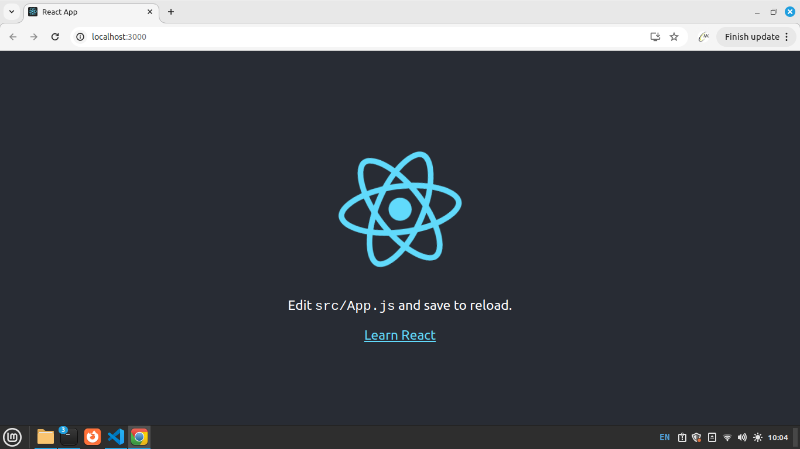
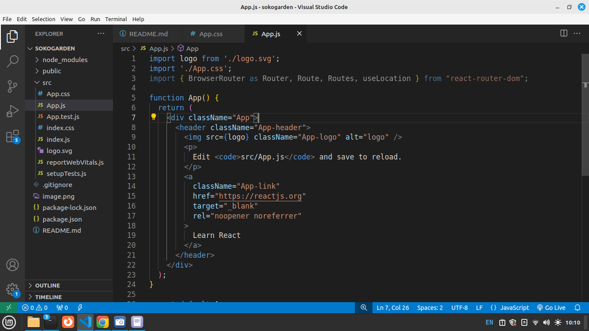

# Getting Started with Create React App

This project was bootstrapped with [Create React App](https://github.com/facebook/create-react-app).

In your class Main folder, create a react app using below command
  
  npx create-react-app sokogarden

<b>Created App Structure. </b>  

sokogarden-app/
├── node_modules/           # Dependencies installed by npm or yarn
├── public/
│   ├── index.html          # The HTML template for the app
│   ├── favicon.ico         # The favicon for the app
│   ├── manifest.json       # The web app's metadata (icon, theme, etc.)
│   └── robots.txt          # Instructions for web crawlers
├── src/
│   ├── App.css             # CSS styles for the App component
│   ├── App.js              # Main App component
│   ├── App.test.js         # Tests for the App component
│   ├── index.css           # Global styles
│   ├── index.js            # Entry point for the app; renders the App component
│   └── logo.svg            # The React logo (used in the default template)
├── .gitignore              # Git ignore file
├── package.json            # Metadata, dependencies, and scripts for the app
├── package-lock.json       # Locks the dependency versions for consistency

In the project directory, you can run:

### `npm start`

Runs the app in the development mode.\
Open [http://localhost:3000](http://localhost:3000) to view it in your browser.

The page will reload when you make changes.\
You may also see any lint errors in the console.

Your React App runs as below on the browser.

Lets Edit our App.
in src Folder open App.js and remove the higlighted code in below screen.

Replace the code yu removed with a heading and as shown below.

Run your App 
Runs the app in the development mode.\
Open [http://localhost:3000](http://localhost:3000) to view it in your browser.
 
<b>Install React Router </b>  

   npm install react-router-dom

React Router will be used to create navigation in our App.
 

