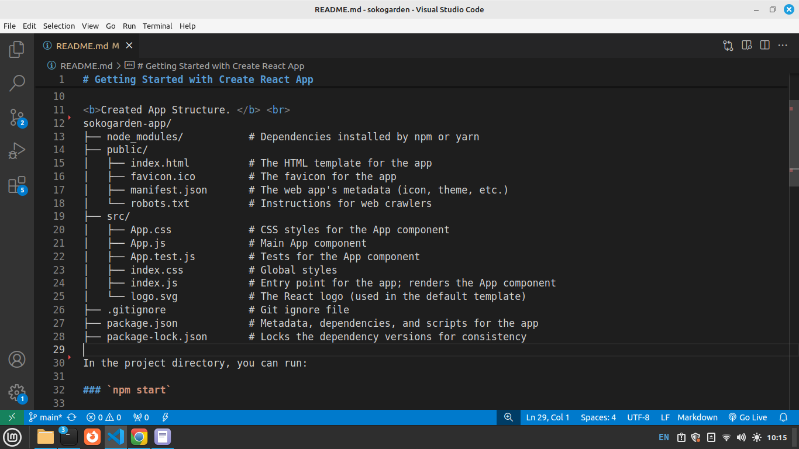
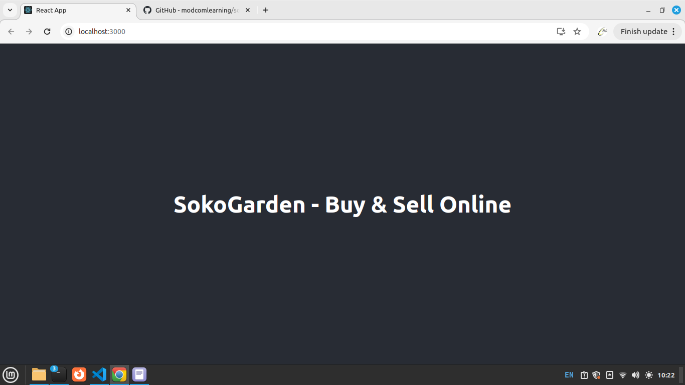

# Getting Started with Create React App
### Step 1 : Create React App, File Structure, Run App
This project was bootstrapped with [Create React App](https://github.com/facebook/create-react-app).

In your class Main folder, create a react app using below command
```
   npx create-react-app sokogarden
```

Below is the App Structure Explained<br>



Runs the app in the development mode.\
Open [http://localhost:3000](http://localhost:3000) to view it in your browser.

The page will reload when you make changes.\
You may also see any lint errors in the console.


Your React App runs as below on the browser.


Lets Edit our App.
in src Folder open App.js and remove the higlighted code(remove everything Inside header tags) in below screen.


Replace the code you removed with a heading and as shown below.


Run your App 
Runs the app in the development mode.\
Open [http://localhost:3000](http://localhost:3000) to view it in your browser.
<br>


<br>
<b>Install React Router </b> <br>
```
   npm install react-router-dom
```

React Router will be used to create navigation in our App.
<br>

### Step 2: Components Creation
In this Project we will have Components to represent different user interfaces. i.e Signup, Signin, GetProducts, Addproducts, MakePayment, Navbar, Footer etc <br>

Above components MUST be created inside the src Folder,
in src Folder, create a subfolder named components. <br>

Right Click on components folder you created above - Select New File - File name Enter - Signup.js.

Inside Signup.js type below code.

```javascript
  const Signup = () => {
    return (
        <div>
            <h1>Welcome to Signup Component</h1>
        </div>
      );
}
 
export default Signup;
```

Right Click on components folder - Select New File - File name Enter - Signin.js.

Inside Signin.js type below code.

```javascript
const Signin = () => {
    
    return ( 
        <div>
            <h1>Welcome to Signup Component</h1>
        </div>
     );
}
 
export default Signin;

```


