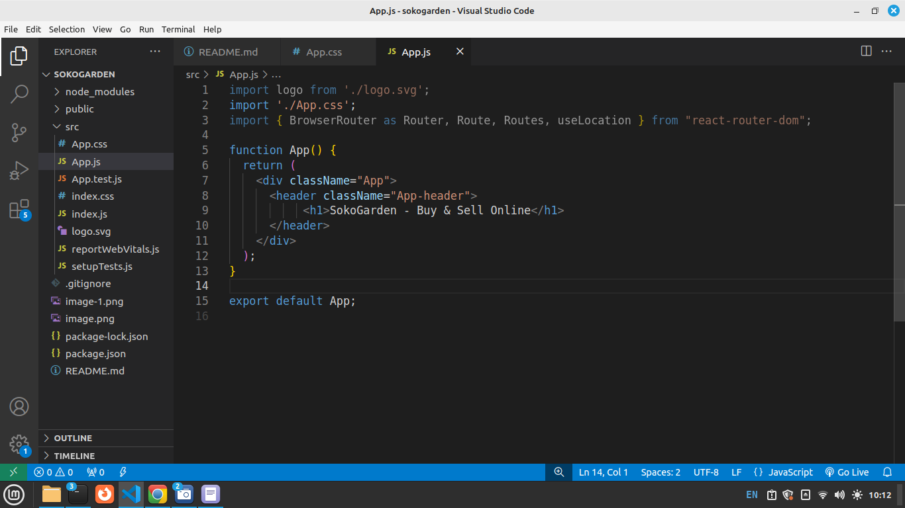
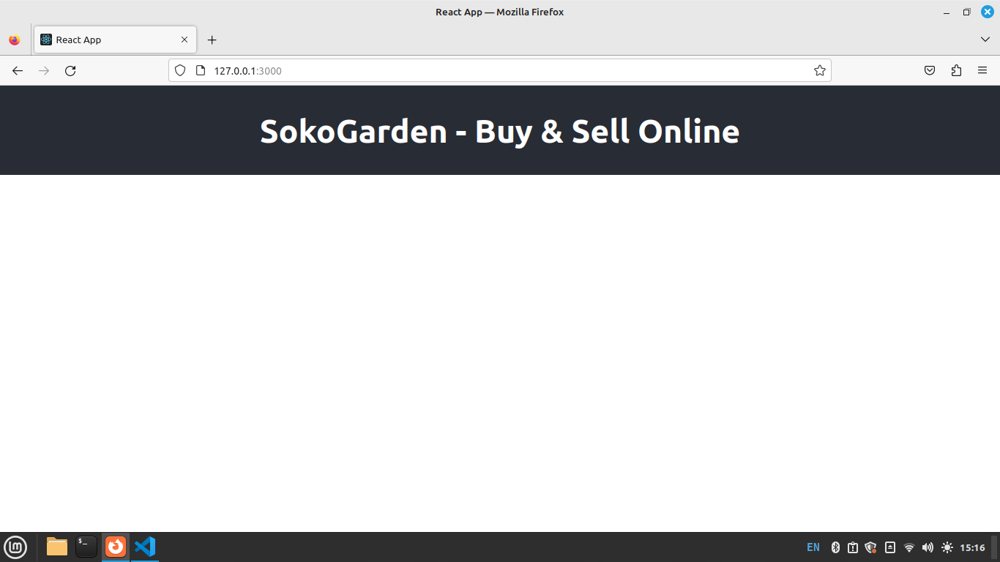

# Getting Started with Create React App
### Step 1 : Create React App, File Structure, Run App
This project was bootstrapped with [Create React App](https://github.com/facebook/create-react-app).

In your class Main folder, create a react app using below command
```
   npx create-react-app sokogarden
```

Below is the App Structure Explained<br>


Runs the app in the development mode.\
Open [http://localhost:3000](http://localhost:3000) to view it in your browser.

The page will reload when you make changes.\
You may also see any lint errors in the console.


Your React App runs as below on the browser.


Lets Edit our App.
in src Folder open App.js and remove the higlighted code(remove everything Inside header tags) in below screen.


Replace the code you removed with a heading and as shown below.



Run your App 
Runs the app in the development mode.\
Open [http://localhost:3000](http://localhost:3000) to view it in your browser.
<br>


<br>
<b>Install React Router </b> <br>
```
   npm install react-router-dom
```

React Router will be used to create navigation in our App.
<br>


In App.css, Please change the min-height to 20vh, see below, This reduces the height of the Main App.js component display.

```css
.App-header {
  background-color: #282c34;
  min-height: 20vh;
  display: flex;
  flex-direction: column;
  align-items: center;
  justify-content: center;
  font-size: calc(10px + 2vmin);
  color: white;
}
```


Run your App 
Runs the app in the development mode.\
Open [http://localhost:3000](http://localhost:3000) to view it in your browser.




### Step 2: Components Creation
In this Project we will have Components to represent different user interfaces. i.e Signup, Signin, GetProducts, Addproducts, MakePayment, Navbar, Footer etc <br>

Above components MUST be created inside the src Folder,
in src Folder, create a subfolder named components. <br>

Right Click on components folder you created above - Select New File - File name Enter - Signup.js.

Inside Signup.js type below code.

```javascript
  const Signup = () => {
    return (
        <div>
            <h1>Welcome to Signup Component</h1>
        </div>
      );
}
 
export default Signup;
```

Right Click on components folder - Select New File - File name Enter - Signin.js.

Inside Signin.js type below code.

```javascript
const Signin = () => {
    
    return ( 
        <div>
            <h1>Welcome to Signup Component</h1>
        </div>
     );
}
 
export default Signin;

```

Right Click on components folder - Select New File - File name Enter - Addproduct.js.

Inside Addproduct.js type below code.

```javascript
    const Addproduct = () => {
        return ( 
            <div>
                <h1>Welcome to Add Products Component</h1>
            </div>
        );
    }
    
    export default Addproduct;

```
Right Click on components folder - Select New File - File name Enter - Getproducts.js.

Inside Getproducts.js type below code.

```javascript
const Getproducts = () => {
    return ( 
        <div>
            <h1>Welcome to Get Products Components</h1>
        </div>
     );
}

export default Getproducts;
```

We now have 4 different Components.
We need to create routing/navigation for them.This means how do we access them on the browser.

### Step 3: Routing
In this Step we will create Router for our App.
in App.js add below import for routing capabilities
 ```javascript
    import { BrowserRouter as Router, Route, Routes, useLocation } from "react-router-dom";
```
Then inside the App.js, under the JSX code, wrap the 'DIV' with a Router

```javascript
import logo from './logo.svg';
import './App.css';
import { BrowserRouter as Router, Route, Routes, useLocation } from "react-router-dom";


function App() {
  return (

    <Router>   
      <div className="App">
            <header className="App-header">
                <h1>SokoGarden - Buy & Sell Online</h1>
            </header>

            
          
      </div>
    </Router>

  );
}

export default App;
```

Below the header tag add below routes.
```jsx
    <Routes>
        <Route path="/signup" element={<Signup />} />
        <Route path="/signin" element={<Signin />} />
        <Route path="/addproduct" element={<Addproduct />} />
        {/* This is the default component */}
        <Route path="/" element={<Getproducts/>} />
    </Routes>
```


This code defines client-side routing in a React application using React Router. Here's a breakdown:

```jsx 
<Routes>: A wrapper that holds multiple <Route> components and ensures only one matching route is rendered at a time.

<Route path="/signup" element={<Signup/>} />: When the URL is /signup, the Signup component is rendered.

<Route path="/signin" element={<Signin />} />: When the URL is /signin, the Signin component is rendered.

<Route path="/addproduct" element={<Addproduct />} />: When the URL is /addproduct, the Addproduct component is rendered.

<Route path="/" element={<Getproducts/>} />: Acts as the default (home) route, rendering Getproducts when the path is /.<br><br>
```


